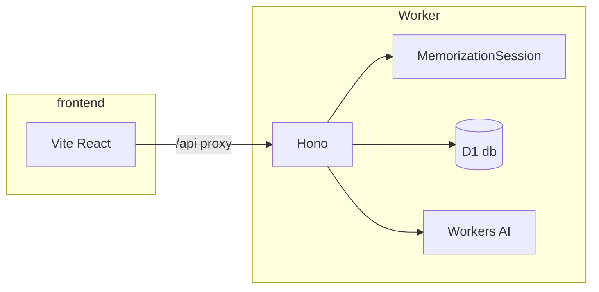

# cf_ai_verbatim

AI-powered verbatim text memorization (Cloudflare internship assignment). Users chunk long text, practice with progressive fading, get hints, and schedule reviews with spaced repetition (SM-2).

## Technical Architecture

- **Edge API:** [`backend/`](backend/) — [Hono](https://hono.dev/) on a [Cloudflare Worker](https://developers.cloudflare.com/workers/). Entry: [`backend/src/index.ts`](backend/src/index.ts).
- **Workers AI:** One `[ai]` binding (`AI`). Llama 3.3 and Whisper are **not** separate bindings; call `env.AI.run(modelId, input)` with:
  - `@cf/meta/llama-3.3-70b-instruct-fp8-fast` (LLM)
  - `@cf/openai/whisper-large-v3-turbo` (speech-to-text)  
  Constants: [`backend/src/constants.ts`](backend/src/constants.ts).
- **State:** [D1](https://developers.cloudflare.com/d1/) database binding `db` in [`backend/wrangler.toml`](backend/wrangler.toml). [Durable Object](https://developers.cloudflare.com/durable-objects/) **`MemorizationSession`** (`MEMORIZATION_SESSION`) stores practice progress (chunk index, step 1–3, Step 2 mask parity for retries) plus SM-2 stubs — [`backend/src/memorization-session.ts`](backend/src/memorization-session.ts), SM-2 math in [`backend/src/sm2.ts`](backend/src/sm2.ts). Practice helpers: [`backend/src/keystrokes.ts`](backend/src/keystrokes.ts), [`backend/src/mask.ts`](backend/src/mask.ts), [`backend/src/practice-api.ts`](backend/src/practice-api.ts).
- **Web UI:** [`frontend/`](frontend/) — Vite + React + TypeScript + Tailwind CSS v4 (`@tailwindcss/vite`). Dev server proxies `/api` to the Worker default port (8787).



## Setup and running

1. **Install dependencies** (Node.js 20+ recommended):

   ```bash
   npm install
   ```

2. **D1 database:** Create a database and put its `database_id` into [`backend/wrangler.toml`](backend/wrangler.toml).

   ```bash
   cd backend
   npx wrangler d1 create cf_ai_verbatim
   ```

3. **Apply D1 migrations** (schema: `sessions`, `chunks` — required for `POST /api/chunk`):

   ```bash
   cd backend
   npx wrangler d1 migrations apply cf_ai_verbatim --local
   # Remote (before deploy):
   npx wrangler d1 migrations apply cf_ai_verbatim --remote
   ```

4. **Run the Worker** (from repo root or `backend/`):

   ```bash
   npm run dev:backend
   ```

   Default: `http://localhost:8787`. `POST /api/chunk` uses Workers AI (Llama 3.3) + D1. **Practice (Feature B):** `GET /api/session/:sessionId/chunks`, `GET /api/practice/:sessionId` (masked text + step), `POST /api/practice/:sessionId/check` (body `{ "input": "..." }` — advances only on correct answer), `POST /api/practice/:sessionId/retry` (Step 2 toggles which words are hidden). `POST /api/hint` and `POST /api/review` are still placeholders; `GET /api/health` for checks.

5. **Run the frontend:**

   ```bash
   npm run dev:frontend
   ```

   Default: `http://localhost:5173` — `/api/*` is proxied to the Worker on 8787.

6. **Deploy:** Configure `database_id`, apply **remote** D1 migrations, then run `npm run deploy --workspace=backend` (or `cd backend && npx wrangler deploy`).

## Troubleshooting

### `POST /api/chunk` returns 502 / `error code: 1031`

Cloudflare does not document **1031** in the public [Workers AI errors](https://developers.cloudflare.com/workers-ai/platform/errors/) table. In practice it often shows up as an **`InferenceUpstreamError`** or similar upstream failure when `env.AI.run(...)` is called.

Try, in order:

1. **Workers & Pages onboarding** — If `wrangler dev` errors with *register a workers.dev subdomain*, finish [Workers onboarding](https://dash.cloudflare.com/) for your account (or use the interactive dev terminal and press **`l`** to prefer local mode where applicable).
2. **Meta Llama license** — First-time use of Llama on Workers AI may require accepting model terms in the dashboard or via a one-time API call; see [Workers AI get started](https://developers.cloudflare.com/workers-ai/get-started/dashboard/) and your model’s docs (e.g. [Llama 3.3 70B](https://developers.cloudflare.com/workers-ai/models/llama-3.3-70b-instruct-fp8-fast/)).
3. **Quotas / capacity** — Free tier neuron limits or regional capacity (`Account limited` / `Out of capacity` in [errors](https://developers.cloudflare.com/workers-ai/platform/errors/)) can surface as generic upstream errors; check the Workers AI section in the dashboard or try again later.
4. **Read the full message** — The API JSON error body may include the underlying Workers AI message (e.g. `Workers AI: …`) from [`backend/src/chunk.ts`](backend/src/chunk.ts).

## Documentation

- Assignment prompts and AI prompt log: [`PROMPTS.md`](PROMPTS.md).
- Product spec: [`PROJECT_SPEC.md`](PROJECT_SPEC.md).
