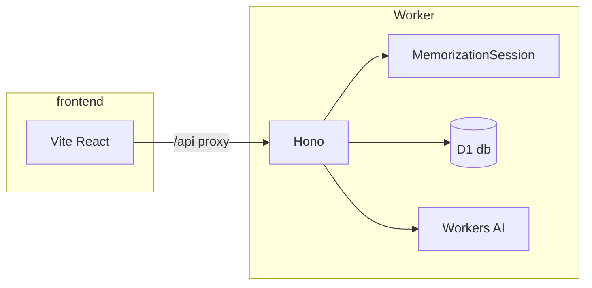

# cf_ai_verbatim

AI-powered verbatim text memorization (using Cloudflare's Agents ecosystem). Users chunk long text with Workers AI, practice with progressive fading (3-step recall), and request context-aware hints. Future updates will include **Spaced repetition** using Anki-style review scheduling—see [Roadmap / future work](#roadmap--future-work) for the planned enhancements.

## Live demo

**Deployed app:** https://cf-ai-verbatim.conradschaumburg.workers.dev

## Technical Architecture

- **Edge API:** [`backend/`](backend/) — [Hono](https://hono.dev/) on a [Cloudflare Worker](https://developers.cloudflare.com/workers/). Entry: [`backend/src/index.ts`](backend/src/index.ts).
- **Workers AI:** One `[ai]` binding (`AI`). Llama 3.3 and Whisper are **not** separate bindings; call `env.AI.run(modelId, input)` with:
  - `@cf/meta/llama-3.3-70b-instruct-fp8-fast` (LLM)
  - `@cf/openai/whisper-large-v3-turbo` (speech-to-text)  
  Constants: [`backend/src/constants.ts`](backend/src/constants.ts).
- **State:** [D1](https://developers.cloudflare.com/d1/) database binding `db` in [`backend/wrangler.toml`](backend/wrangler.toml). [Durable Object](https://developers.cloudflare.com/durable-objects/) **`MemorizationSession`** (`MEMORIZATION_SESSION`) stores practice progress (chunk index, step 1–3, Step 2 mask parity for retries) and persists **SM-2 state** as groundwork for a future review API — [`backend/src/memorization-session.ts`](backend/src/memorization-session.ts), SM-2 math in [`backend/src/sm2.ts`](backend/src/sm2.ts). Practice helpers: [`backend/src/keystrokes.ts`](backend/src/keystrokes.ts), [`backend/src/mask.ts`](backend/src/mask.ts), [`backend/src/practice-api.ts`](backend/src/practice-api.ts), [`backend/src/wordPieces.ts`](backend/src/wordPieces.ts). Hints: [`backend/src/hint.ts`](backend/src/hint.ts).
- **Web UI:** [`frontend/`](frontend/) — Vite + React + TypeScript + Tailwind CSS v4 (`@tailwindcss/vite`). Dev server proxies `/api` to the Worker default port (8787). In production, `npm run deploy` uploads the Vite build from `frontend/dist` with the Worker so the app and API share one URL.



## Setup and running

The assignment asks for instructions to try the app **either locally or via a deployed link**—you do not need both. Steps 4–5 below cover **local** development; **Deploy** (step 6) is the optional path to a single public URL.

1. **Install dependencies** (Node.js 20+ recommended):

   ```bash
   npm install
   ```

2. **D1 database:** Create a database and put its `database_id` into [`backend/wrangler.toml`](backend/wrangler.toml).

   ```bash
   cd backend
   npx wrangler d1 create cf_ai_verbatim
   ```

3. **Apply D1 migrations** (schema: `sessions`, `chunks` — required for `POST /api/chunk`):

   ```bash
   cd backend
   npx wrangler d1 migrations apply cf_ai_verbatim --local
   # Remote (before deploy):
   npx wrangler d1 migrations apply cf_ai_verbatim --remote
   ```

4. **Run the Worker** (from repo root or `backend/`):

   ```bash
   npm run dev:backend
   ```

   Default: `http://localhost:8787`. `POST /api/chunk` uses Workers AI (Llama 3.3) + D1. **Practice (Feature B):** `GET /api/session/:sessionId/chunks`, `GET /api/practice/:sessionId` (returns `maskedText`, `chunkPlain`, `expectedFirstLetters`, step, chunk index), `POST /api/practice/:sessionId/check` (body `{ "input": "..." }` — advances only on correct answer), `POST /api/practice/:sessionId/retry` (Step 2 toggles which words are hidden). The web UI uses an **inline** practice surface (focus the passage, type first letters in order; it auto-submits when the sequence is complete). **Hints (Feature C):** `POST /api/hint` with JSON body `{ "sessionId": "…", "chunkIndex": 0, "wordIndex": 0 }` — `chunkIndex` must match the server’s current practice chunk, `wordIndex` matches whitespace-delimited word tokens (same as the practice UI). Returns `{ "ok": true, "hint": "…" }` or an error. Implementation: [`backend/src/hint.ts`](backend/src/hint.ts). **`POST /api/review` (Feature D / spaced repetition) is deferred** — returns HTTP **501** with a JSON body pointing to [Roadmap / future work](#roadmap--future-work) below. `GET /api/health` for checks.

5. **Run the frontend:**

   ```bash
   npm run dev:frontend
   ```

   Default: `http://localhost:5173` — `/api/*` is proxied to the Worker on 8787.

6. **Deploy (optional public URL):** The Worker is configured to serve the **built** React app from `frontend/dist` via [Workers static assets](https://developers.cloudflare.com/workers/static-assets/) and SPA fallback (`index.html` for client routes), so the UI and `/api` share one origin and relative `fetch("/api/...")` calls work in production.

   1. Put your `database_id` in [`backend/wrangler.toml`](backend/wrangler.toml) and apply **remote** D1 migrations (step 3 with `--remote`).
   2. From the **repository root**:

      ```bash
      npm run deploy
      ```

      This builds the frontend (`frontend/dist/`) then runs `wrangler deploy` in `backend/`. The deploy step expects `frontend/dist` to exist; if you only run `wrangler deploy` from `backend/` without building first, upload may fail.

   3. Wrangler prints the Worker URL (for example `https://cf-ai-verbatim.<account>.workers.dev`). Open that link in a browser to try the full app without a local dev server.

   To exercise the same Worker + assets setup locally, build the frontend first, then run `npm run dev:backend` — Wrangler serves uploaded assets when `frontend/dist` is present.

## Roadmap / future work

**Additional note (not yet implemented):** Planned updates include:

1. **Saved history** — Let users keep a **history of passages they have chunked** (and related session metadata) so they can reopen past material without re-pasting or re-running the LLM.
2. **Anki-style spaced repetition** — Layer **SRS scheduling** (self-ratings, intervals, due reviews) on memorized texts, aligned with [`PROJECT_SPEC.md`](PROJECT_SPEC.md) Feature D (SM-2). The repo already contains SM-2 math in [`backend/src/sm2.ts`](backend/src/sm2.ts) and persisted SM-2 fields on the Durable Object; wiring **`POST /api/review`**, a review UI, and optional **per-card / due-date** behavior is future work.

## Troubleshooting

### `wrangler deploy` fails: `new_sqlite_classes` / code 10097 (Free plan)

On **Workers Free**, only [SQLite-backed Durable Objects](https://developers.cloudflare.com/durable-objects/reference/durable-objects-migrations/) are allowed. [`backend/wrangler.toml`](backend/wrangler.toml) must use `new_sqlite_classes` (not `new_classes`) for the initial migration. The `MemorizationSession` class still uses the familiar key-value storage API; SQLite is the platform storage backend.

### `POST /api/chunk` returns 502 / `error code: 1031`

Cloudflare does not document **1031** in the public [Workers AI errors](https://developers.cloudflare.com/workers-ai/platform/errors/) table. In practice it often shows up as an **`InferenceUpstreamError`** or similar upstream failure when `env.AI.run(...)` is called.

Try, in order:

1. **Workers & Pages onboarding** — If `wrangler dev` errors with *register a workers.dev subdomain*, finish [Workers onboarding](https://dash.cloudflare.com/) for your account (or use the interactive dev terminal and press **`l`** to prefer local mode where applicable).
2. **Meta Llama license** — First-time use of Llama on Workers AI may require accepting model terms in the dashboard or via a one-time API call; see [Workers AI get started](https://developers.cloudflare.com/workers-ai/get-started/dashboard/) and your model’s docs (e.g. [Llama 3.3 70B](https://developers.cloudflare.com/workers-ai/models/llama-3.3-70b-instruct-fp8-fast/)).
3. **Quotas / capacity** — Free tier neuron limits or regional capacity (`Account limited` / `Out of capacity` in [errors](https://developers.cloudflare.com/workers-ai/platform/errors/)) can surface as generic upstream errors; check the Workers AI section in the dashboard or try again later.
4. **Read the full message** — The API JSON error body may include the underlying Workers AI message (e.g. `Workers AI: …`) from [`backend/src/chunk.ts`](backend/src/chunk.ts).

## Documentation

- Assignment prompts and AI prompt log: [`PROMPTS.md`](PROMPTS.md).
- Product spec: [`PROJECT_SPEC.md`](PROJECT_SPEC.md).
